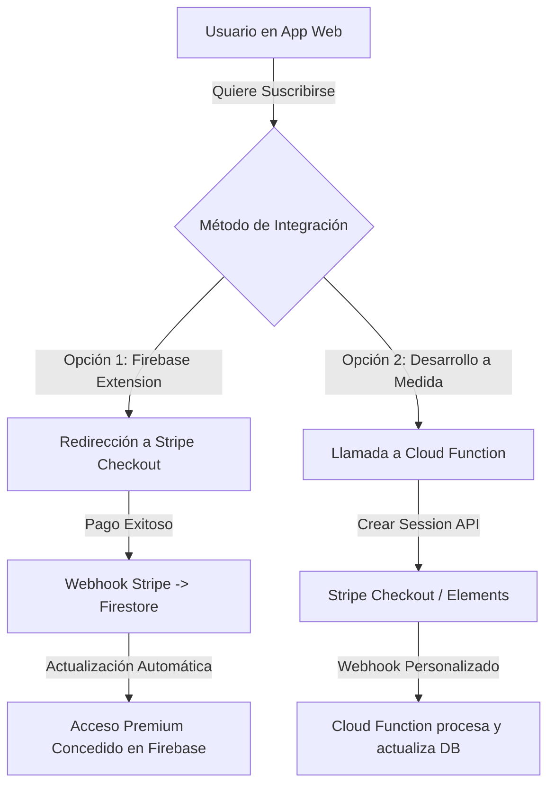

# Análisis de Calidad e Integración de Stripe - FinanzasPro

Este documento detalla un análisis técnico exhaustivo de los archivos actuales de la aplicación **FinanzasPro**, identificando errores críticos, vulnerabilidades latentes y áreas de mejora sin modificar el código. Además, presenta un estudio detallado de arquitectura para la monetización de la plataforma utilizando **Stripe**.

---

## 🔍 Parte 1: Errores y Áreas de Mejora en el Código Actual

Tras una revisión profunda de la estructura HTML, las hojas de estilo CSS y los scripts JS, se han detectado los siguientes detalles técnicos que conviene corregir para garantizar la robustez, mantenibilidad y rendimiento del dashboard:

### 1. Formateo Malformado en el CSS (`css/style.css`)
> [!WARNING]
> **Severidad: Alta**
> 
> En la sección final de `css/style.css` (desde la línea 556 a la 616), las propiedades CSS y selectores tienen **espacios entre cada uno de sus caracteres**:
> ```css
>  / *   - - -   A I   I n s i g h t s   C a r d   - - -   * / 
>  . a i - i n s i g h t s - c a r d   { 
>          b o r d e r :   1 p x   s o l i d   t r a n s p a r e n t ; 
> ```
> Aunque algunos motores de renderizado pueden intentar interpretar parte de este bloque, es código sintácticamente inválido para los estándares CSS modernos y provocará fallos visuales en múltiples navegadores, además de ser imposible de mantener. Debe reformatearse a su estado limpio:
> ```css
> /* --- AI Insights Card --- */
> .ai-insights-card {
>     border: 1px solid transparent;
>     background-image: linear-gradient(var(--bg-card), var(--bg-card)), 
>                       linear-gradient(135deg, var(--color-primary), #ec4899);
>     background-origin: border-box;
>     background-clip: padding-box, border-box;
>     position: relative;
> }
> ```

### 2. Condición de Carrera en la Autenticación (Race Condition)
> [!IMPORTANT]
> **Severidad: Alta (Fallo de Lógica)**
> 
> En `js/auth.js` y `js/main.js`, se coordinan los estados de autenticación mediante eventos personalizados en el objeto global `window`:
> - `auth.js` escucha `onAuthStateChanged` y despacha `user-logged-in`.
> - `main.js` escucha `user-logged-in` para cargar los datos del usuario.
>
> **El problema:** Ambos scripts son cargados como módulos (`type="module"`), lo que significa que se ejecutan de forma asíncrona y diferida. Si Firebase Auth resuelve la sesión del usuario (de manera local/caché) de forma muy rápida antes de que `main.js` termine de compilarse, cargarse y registrar el listener `window.addEventListener('user-logged-in')`, **el evento se perderá** y el Dashboard se quedará eternamente en estado vacío para un usuario que sí está logueado.
>
> **Solución recomendada:** Eliminar los eventos personalizados de `window`. Dado que ambos archivos importan la misma instancia de `auth` de `firebase-config.js`, `main.js` debería registrar su propio observer `onAuthStateChanged(auth, (user) => { ... })` para cargar o limpiar la base de datos de forma directa y 100% segura.

### 3. Uso de Handlers Inline (`onclick`) en Módulos ES6
> [!NOTE]
> **Severidad: Media**
> 
> En `finanzas.html` (línea 94) y `js/main.js` (línea 250), se usan llamadas inline como `onclick="window.logout()"` y `onclick="window.deleteTransaction('${transaction.id}')"`.
> 
> En el desarrollo de JavaScript moderno con módulos (ES modules):
> - Los ámbitos de las variables y funciones están aislados dentro de cada módulo.
> - Forzar funciones al objeto global `window` (`window.logout = ...`) es una mala práctica para evitar colisiones y contaminación del espacio de nombres.
> - Si un script falla al cargar, hacer clic en los botones lanzará errores de tipo `Uncaught ReferenceError: logout is not defined`.
>
> **Solución recomendada:** Utilizar delegación de eventos en JS:
> ```javascript
> // En main.js para eliminar transacciones:
> list.addEventListener('click', (e) => {
>     const deleteBtn = e.target.closest('.delete-btn');
>     if (deleteBtn) {
>         const id = deleteBtn.getAttribute('data-id');
>         deleteTransaction(id);
>     }
> });
> ```

### 4. Etiqueta `<title>` Duplicada en el Head
> [!TIP]
> **Severidad: Baja (SEO)**
> 
> En `finanzas.html`, la etiqueta de título de la página está declarada dos veces:
> - **Línea 6:** `<title>FinanzasPro | Dashboard de Gestión Financiera...</title>`
> - **Línea 31:** `<title>FinanzasPro | Dashboard de Gestión Financiera...</title>`
> Esto confunde a los indexadores SEO. Debe removerse una de ellas (preferiblemente la de la línea 31).

### 5. Elemento de Filtro Flotante Inadecuado
> [!NOTE]
> **Severidad: Baja (Maquetación)**
> 
> En `finanzas.html` (línea 116), dentro del bloque `.date-filters`:
> ```html
> <button id="apply-filter" class="icon-btn" title="Aplicar Filtro"><i class="fa-solid fa-filter"></i></button> <p>Filtrar</p>
> ```
> El elemento `<p>Filtrar</p>` está suelto inmediatamente después del botón. Dado que `.date-filters` no tiene reglas explícitas de layout en el CSS, este elemento flotante podría romper la alineación flex de la barra de filtros o verse desalineado en pantallas móviles.

### 6. Sombreado de Variables en `js/main.js`
> [!TIP]
> **Severidad: Baja (Mantenibilidad)**
> 
> En la línea 9 de `js/main.js`, se define la constante global para el elemento del DOM del saldo:
> ```javascript
> const balance = document.getElementById('total-balance');
> ```
> Sin embargo, en la línea 386, dentro de la función `updateAIAdvice(income, expense)` se declara:
> ```javascript
> const balance = income - expense;
> ```
> Aunque JavaScript lo permite debido al ámbito de bloque, el sombreado (shadowing) de variables dificulta la legibilidad del código y aumenta el riesgo de introducir bugs si un desarrollador confunde la constante del DOM con el cálculo numérico. Se recomienda renombrar la constante interna como `currentBalance` o `calculatedBalance`.

---

## 💳 Parte 2: Análisis para Integrar Stripe y Monetizar la App

Integrar **Stripe** en una aplicación web sin servidor (Serverless) basada en Firebase es una estrategia sumamente eficiente. A continuación se analiza la viabilidad, el modelo de negocio y los dos caminos técnicos para lograrlo.

### A. Modelo de Negocio Propuesto
1. **Suscripción SaaS (Recomendado):** Un plan mensual de bajo costo (ej. $3.99/mes) para desbloquear funciones Premium como la exportación ilimitada de PDFs y consejos financieros avanzados de la IA en tiempo real.
2. **Modelo Freemium (Basado en Límites):** El usuario gratuito puede registrar hasta 15 transacciones al mes. Para registrar más o añadir múltiples monedas, se requiere el plan de pago.

---

### B. Opciones Técnicas de Integración



#### Opción 1: Extensión Oficial de Firebase ("Run Payments with Stripe")
Esta es la opción recomendada para mantener el proyecto rápido de implementar, seguro y libre de código de backend complejo.

*   **¿Cómo funciona?**
    1. Instalas la extensión oficial en tu consola de Firebase.
    2. La extensión crea automáticamente colecciones especiales en tu Firestore (`customers`, `products`, `subscriptions`).
    3. Cuando un usuario quiere pagar, tu código en el frontend añade un documento a una subcolección del usuario en Firestore.
    4. La extensión detecta este documento, genera una sesión de Stripe Checkout y te devuelve una URL.
    5. Rediriges al usuario al portal de pago de Stripe. Tras pagar, Stripe envía un webhook automático a la extensión, la cual actualiza el estado de la suscripción del usuario en Firestore.
    6. En tu código frontend (`main.js`), solo tienes que leer si el usuario tiene `role === 'premium'` en su perfil para habilitar las características premium.
*   **Ventajas:**
    - **Sin backend propio:** No necesitas escribir ni mantener código en Node.js para procesar los pagos.
    - **100% Seguro:** Stripe maneja los datos bancarios y cumple con la normativa PCI.
    - **Portal de cliente:** Incluye soporte automático para que el usuario cancele o actualice su suscripción en una página segura de Stripe.

#### Opción 2: Desarrollo a Medida con Firebase Cloud Functions
Si requieres un control total sobre el proceso de compra, el diseño de la pasarela dentro de tu propia web (usando Stripe Elements) o dinámicas de cobro complejas.

*   **¿Cómo funciona?**
    1. Habilitas las Firebase Cloud Functions en tu proyecto (requiere plan de pago "Blaze" en Firebase, aunque el consumo bajo es gratuito).
    2. Desarrollas una función HTTP en Node.js que reciba la solicitud del cliente, interactúe con el SDK de Stripe (`stripe.checkout.sessions.create`) y devuelva el enlace de pago.
    3. Creas una segunda función HTTP que funcione como **Webhook** para recibir eventos desde Stripe (ej: `invoice.paid`, `customer.subscription.deleted`) y actualice la base de datos de manera programática.
*   **Ventajas:**
    - Personalización absoluta del flujo de checkout y lógica de promociones complejas.
    - Evita el uso de la extensión si deseas mantener tu base de datos Firestore limpia de colecciones generadas externamente.

---

### C. Plan de Implementación Paso a Paso (Usando la Opción 1)

Si decides seguir adelante con el cobro por Stripe en el futuro, este sería el camino de desarrollo idóneo sin alterar drásticamente la estructura de tu SPA (Single Page Application):

1.  **Configuración de Stripe:**
    - Crear una cuenta en Stripe y cambiar a modo de prueba (Test Mode).
    - Crear un **Producto** (ej. "Suscripción FinanzasPro Premium") con un precio recurrente mensual de $3.99 USD.
2.  **Instalar la Extensión de Firebase:**
    - En la consola de Firebase, instalar la extensión **"Run Payments with Stripe"**.
    - Configurar las claves API secretas de Stripe en los parámetros de la extensión.
3.  **Añadir Lógica de Control de Acceso en Firestore Rules:**
    - Asegurar que solo la extensión pueda modificar las colecciones de suscripciones, y que el usuario solo pueda leerlas.
4.  **Actualizar el Frontend (Cuando estés listo para implementarlo):**
    - En `finanzas.html`, añadir un botón o banner: `"Mejorar a Premium"`.
    - En `main.js`, si el usuario hace clic, escribir en la colección del usuario para que la extensión cree la sesión de Checkout.
    - Escuchar el cambio en la suscripción del usuario en tiempo real con `onSnapshot` de Firestore para desbloquear inmediatamente la interfaz completa.
